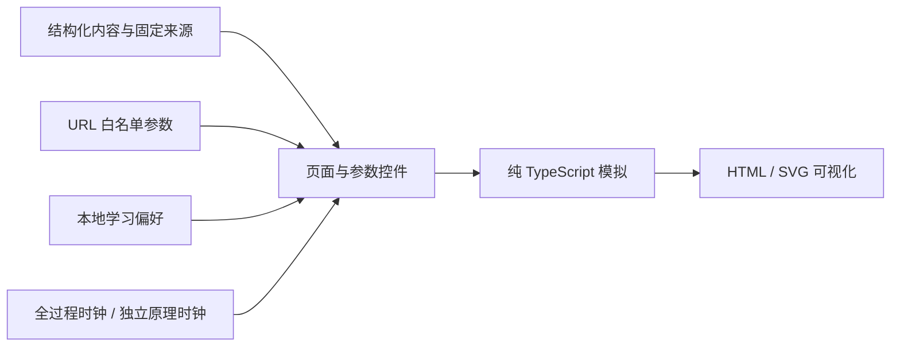

# 架构与扩展边界

React / TypeScript / Vite 单页应用，路由按页面和实验延迟加载。自托管两套 Latin 字体，中文回退到系统字体；不依赖图片 CDN、在线 API 或模型下载。

## 状态约定

- 页面数据从 `content` 获取，学习内容按深度提供不同信息，框架检索返回模块深链；网络参数不从教学控件反向覆盖真实预设。
- 模拟函数验证输入，返回有限数据；图形读取同一结果，不能各自生成脱离状态的数字。
- URL 保存可分享的白名单配置，不保存请求队列等瞬时实验轨迹。非法/重复参数恢复默认并给出提示。
- `PreferencesProvider` 保持全站会话状态；存储故障不阻断导航。版本不匹配恢复默认，不把浏览次数解释为技能掌握。
- `useTimeline` / `TimelineClock` 负责全过程与原理的共享分段/连续时间轴；关键帧索引是同一轨迹的采样，连续模式有分数位置与RAF调度。每个实例独立观察本地元素、管理时钟；打开模块暂停主流程。其他实验保留 `usePlayback`；切换模型/场景/参数重置，卸载清理，后台及离屏暂停。
- 模拟错误由对应页面处理，分页容量不足保持原分配，量化/采样纯函数拒绝非有限输入。

## 教学范围

完整推理工作台通过 `src/simulation/inferenceTrace.ts` 生成不可变事件帧，按真实模型的混合层顺序计算 H=4 教学网络；请求、层历史、物理页、概率和输出由同一轨迹驱动。`src/mechanisms/catalog.ts` 生成29种独立原理的计算 / 工程事件帧，`MechanismPlayer` 负责局部交互。首页概览仍为固定夹具；网络结构页是真实结构加示意激活；递归/卷积状态为独立小规模教学夹具；注意力矩阵是标准因果 softmax 的小型例子，不能等同于混合网络的所有层。KV 估算、批处理时钟和投机成本均有明确公式或假设。源码图按固定 commit 的入口/核心模块组织，区分直接调用、消息传递与数据关系，并注明折叠中间层。

## 实测扩展

`Observation` 为数值、单位、来源（simulation / estimate / measured）与假设提供统一字段，当前尚未接入 measured 数据。B 阶段需要独立后端、模型和硬件版本记录、请求事件协议、授权与资源限额；新增真实观测适配层，再复用图形组件。浏览器负责交互展示，不承载 27B / 35B 模型权重。教学重放与实时事件必须有显式模式，不能混合成无法解释的性能数字。
